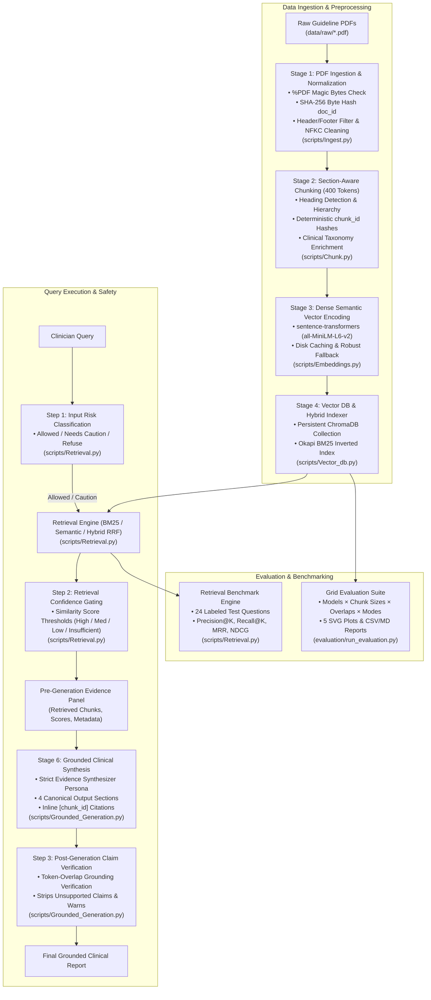
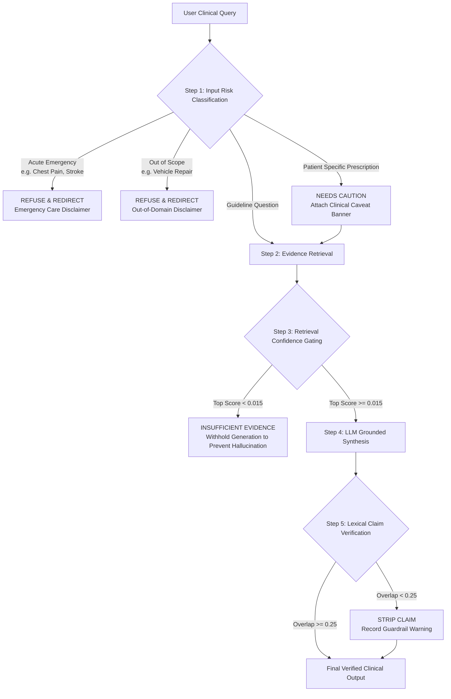

# Clinical Practice Guidelines RAG Pipeline

[](https://www.python.org/downloads/)
[](https://opensource.org/licenses/MIT)
[](https://www.trychroma.com/)
[](https://ai.google.dev/)
[](https://huggingface.co/sentence-transformers/all-MiniLM-L6-v2)

An end-to-end, layout-aware Retrieval-Augmented Generation (RAG) system engineered to ingest, clean, enrich, index, retrieve, synthesize, and benchmark official clinical practice guidelines—specifically **NICE Guideline NG259** (*Osteoporosis: assessing the risk of fragility fracture*) and **USPSTF Recommendations** (*Screening for Osteoporosis to Prevent Fractures*). It delivers evidence-grounded clinical recommendations with deterministic source lineage, section attribution, 4-tier confidence ratings, 3-tier clinical safety guardrails, and automated Information Retrieval (IR) evaluation metrics.

---

## 📋 Table of Contents

- [Project Overview](#-project-overview)
- [System Architecture](#️-system-architecture)
- [Project Directory Structure](#-project-directory-structure)
- [Pipeline Stages (1 to 6)](#-pipeline-stages-1-to-6)
- [Clinical Safety, Guardrails & Verification](#-clinical-safety-guardrails--verification)
- [Consistent Metadata Schemas & Hashing](#-consistent-metadata-schemas--hashing)
- [Setup & Installation](#️-setup--installation)
- [CLI & Command Usage Guide](#-cli--command-usage-guide)
- [Multi-Configuration Retrieval Benchmark](#-multi-configuration-retrieval-benchmark)
- [Grid Evaluation & Visualization Suite (`evaluation/`)](#-grid-evaluation--visualization-suite-evaluation)
- [Architectural Validation & Test Suite](#-architectural-validation--test-suite)
- [Clinical Disclaimer](#-clinical-disclaimer)

---

## 📋 Project Overview

### Clinical Problem Statement
Clinical practice guidelines are published as dense, multi-page PDFs with complex formatting, running headers, footers, pagination artifacts, disclosure boilerplate, and tabular data. Clinicians need fast, deterministic, verifiable answers grounded strictly in guideline evidence, accompanied by exact section headings, page numbers, inline citations, and explicit safety boundaries that prevent hallucinated medical recommendations.

### Key Architectural Capabilities
1. **Layout-Aware PDF Ingestion ([`scripts/Ingest.py`](file:///E:/Nadod/Osteoporosis_RAG/scripts/Ingest.py))**: Verifies `%PDF` magic bytes, extracts document elements, filters structural noise (`Header`, `Footer`, `PageBreak`), cleans text with Unicode NFKC normalization and de-hyphenation, computes SHA-256 byte hashes for `document_id`, and outputs [`data/processed/elements.json`](file:///E:/Nadod/Osteoporosis_RAG/data/processed/elements.json).
2. **Section-Aware Semantic Chunking ([`scripts/Chunk.py`](file:///E:/Nadod/Osteoporosis_RAG/scripts/Chunk.py))**: Applies 400-token sliding window chunking (`tiktoken` `cl100k_base`) with 50-token overlap, detects section headings from layout titles/regex (defaulting to `"Unknown Section"`), generates deterministic content-based `chunk_id` hashes, enriches clinical taxonomy (population, clinical topics, issuer), and saves [`data/processed/chunks.json`](file:///E:/Nadod/Osteoporosis_RAG/data/processed/chunks.json).
3. **Dense Semantic Embeddings ([`scripts/Embeddings.py`](file:///E:/Nadod/Osteoporosis_RAG/scripts/Embeddings.py))**: Encodes text into 384-dimensional dense vectors using open-source `sentence-transformers` (`all-MiniLM-L6-v2`) with disk caching and deterministic fallback, saving [`data/processed/embeddings.json`](file:///E:/Nadod/Osteoporosis_RAG/data/processed/embeddings.json).
4. **Persistent Vector Database & Indexing ([`scripts/Vector_db.py`](file:///E:/Nadod/Osteoporosis_RAG/scripts/Vector_db.py))**: Maintains a persistent ChromaDB vector collection at `data/processed/chroma_db/` and builds a hybrid Okapi BM25 + Dense Semantic index in [`data/processed/index.json`](file:///E:/Nadod/Osteoporosis_RAG/data/processed/index.json).
5. **Multi-Mode Retrieval Engine & Benchmark ([`scripts/Retrieval.py`](file:///E:/Nadod/Osteoporosis_RAG/scripts/Retrieval.py))**: Implements Keyword (BM25), Semantic (Cosine), and Hybrid (Reciprocal Rank Fusion - RRF) search with Pre-Generation Evidence Panels, 3-tier safety guardrails, and automated evaluation (Precision@K, Recall@K, Hit@K, MRR, MAP@K, NDCG@K).
6. **Grounded Clinical Synthesis & Claim Verification ([`scripts/Grounded_Generation.py`](file:///E:/Nadod/Osteoporosis_RAG/scripts/Grounded_Generation.py))**: Generates structured 4-section clinical reports with inline citations, retrieval score confidence gating (`< 0.015` returns Insufficient Evidence), and post-generation lexical overlap claim verification to strip unsupported assertions.
7. **Comprehensive Evaluation & Grid Experimentation Suite ([`evaluation/`](file:///E:/Nadod/Osteoporosis_RAG/evaluation/) & [`scripts/evaluate_experiments.py`](file:///E:/Nadod/Osteoporosis_RAG/scripts/evaluate_experiments.py))**: Parameter sweeps across chunk sizes, overlaps, models, search modes, and Top-K depths with 5 automated SVG comparison charts and full CSV/JSON/Markdown reports.

---

## 🏗️ System Architecture



---

## 📁 Project Directory Structure

```text
Osteoporosis_RAG/
├── .env                              # Environment configuration (paths, models, thresholds)
├── .gitignore                        # Git ignore rules
├── requirements.txt                  # Python dependencies (sentence-transformers, chromadb, etc.)
├── README.md                         # Comprehensive project documentation
├── main.py                           # Unified CLI entrypoint (subcommands: run, ask, chat, compare, experiment, etc.)
├── run_pipeline_checks.py            # Backward compatibility test launcher
├── data/
│   ├── sources.json                  # Source registry mapping guidelines to official URLs and metadata
│   ├── eval_questions.json           # 24 labeled, categorized clinical benchmark questions
│   ├── raw/                          # Source clinical guideline PDFs (NICE NG259, USPSTF)
│   ├── cleaned/                      # Text extracted and cleaned files
│   ├── guidelines/                   # Guideline document references
│   ├── vector_store/                 # Supplementary vector storage
│   ├── eval_results/                 # Benchmark outputs (comparison reports, JSON scores)
│   └── processed/                    # Canonical pipeline data artifacts
│       ├── elements.json             # Stage 1: Layout elements with element_ids
│       ├── chunks.json               # Stage 2: 400-token semantic chunks with clinical taxonomy
│       ├── embeddings.json           # Stage 3: Dense vector embeddings
│       ├── index.json                # Stage 4: Consolidated BM25 + Vector retrieval index
│       └── chroma_db/                # Stage 4: Persistent ChromaDB vector database
├── src/
│   ├── __init__.py                   # Package marker
│   ├── schema.py                     # Core data models (Chunk, Page, Citation, ClinicalSynthesisResponse, ConfidenceTier, etc.)
│   └── utils.py                      # Shared utilities (compute_content_hash, clean_text, count_tokens)
├── scripts/
│   ├── __init__.py                   # Package initialization & stage exports
│   ├── Ingest.py                     # Stage 1: PDF Ingestion & Structural Noise Filtering
│   ├── Chunk.py                      # Stage 2: Section-Aware Semantic Chunking & Taxonomy Enrichment
│   ├── Embeddings.py                 # Stage 3: Dense Semantic Embedding Generation
│   ├── Vector_db.py                  # Stage 4: Vector Database Store & Hybrid Indexer
│   ├── Retrieval.py                  # Stage 5: Multi-Mode Retrieval Engine & Benchmark Evaluator
│   ├── Grounded_Generation.py        # Stage 6: Grounded Clinical Synthesis & Claim Verification
│   ├── evaluate_experiments.py       # Grid Experimentation Engine with hyperparameter sweep
│   └── validate_pipeline.py          # Architectural pipeline validator (9 comprehensive checks)
├── evaluation/
│   ├── config.py                     # Evaluation hyperparameter grid configuration
│   ├── run_evaluation.py             # Dedicated Grid Evaluation runner with SVG plot generation
│   ├── cache/                        # Cached embedding models and temporary chunks
│   ├── plots/                        # Generated SVG comparison visualizations
│   │   ├── plot1_chunk_size_vs_recall.svg
│   │   ├── plot2_chunk_overlap_vs_recall.svg
│   │   ├── plot3_search_type_comparison.svg
│   │   ├── plot4_embedding_model_comparison.svg
│   │   └── plot5_top_configurations_ranked.svg
│   ├── evaluation_results.csv        # Detailed per-query retrieval results
│   ├── evaluation_summary.csv        # Aggregated leaderboard across configurations
│   ├── best_configuration.json       # Top-performing hyperparameter set
│   └── evaluation_report.md          # Full Markdown evaluation summary
└── tests/
    ├── __init__.py                   # Test package marker
    └── test_pipeline.py              # Pytest test suite covering all modules
```

---

## ⚙️ Pipeline Stages (1 to 6)

### Stage 1: PDF Ingestion & Text Normalization ([`scripts/Ingest.py`](file:///E:/Nadod/Osteoporosis_RAG/scripts/Ingest.py))
- **Integrity Validation**: Verifies `%PDF` magic bytes before opening files.
- **Deduplication / Identity**: Computes SHA-256 byte hashes over file contents to yield immutable 12-hex-character `document_id`s.
- **Layout Element Extraction**: Employs `unstructured` / `pypdf` to parse layout blocks into typed elements (`Title`, `NarrativeText`, `ListItem`, `Table`, etc.).
- **Structural Noise Filtering**: Removes running headers, footers, page numbering, copyright notices, and publication metadata.
- **Text Normalization**: Unicode NFKC normalization, smart whitespace consolidation, ligature unfolding, and hyphenation stitching across line breaks.
- **Output**: `data/processed/elements.json`.

### Stage 2: Section-Aware Semantic Chunking ([`scripts/Chunk.py`](file:///E:/Nadod/Osteoporosis_RAG/scripts/Chunk.py))
- **Token-Bounded Sizing**: Slices elements into **400-token chunks** with **50-token sliding overlap** using `tiktoken` (`cl100k_base`).
- **Heading Detection**: Tracks hierarchical section headings from `Title`/`Header` elements with numbered section regex fallbacks (e.g., `1.1 Risk factors`). If no heading is present, defaults explicitly to `"Unknown Section"`.
- **Deterministic Chunk IDs**: Identifiers are content hashes generated from `(document_id + text + page_number)`, e.g., `9df46d5cbe98_chk_78a16fb0`.
- **Clinical Taxonomy Enrichment**: Extracts structured metadata tags:
  - `topics`: *Screening & Diagnosis*, *FRAX & Risk Assessment*, *Pharmacological Treatment*, *Monitoring & DXA*.
  - `population`: *Women Aged >= 65*, *Men Aged >= 75*, *Postmenopausal Women*, *Adults on Glucocorticoids*.
  - `guideline_issuer`: *NICE*, *USPSTF*, *NOS*, *NOGG*.
- **Output**: `data/processed/chunks.json`.

### Stage 3: Dense Semantic Vector Generation ([`scripts/Embeddings.py`](file:///E:/Nadod/Osteoporosis_RAG/scripts/Embeddings.py))
- **Model**: `sentence-transformers/all-MiniLM-L6-v2` (384-dimensional dense vectors).
- **Batch Processing**: Encodes chunk text in normalized batches with progress logging.
- **Fallback Architecture**: Deterministic hashing fallback for zero-dependency test execution.
- **Output**: `data/processed/embeddings.json`.

### Stage 4: Persistent Vector DB & Hybrid Index ([`scripts/Vector_db.py`](file:///E:/Nadod/Osteoporosis_RAG/scripts/Vector_db.py))
- **ChromaDB Vector Store**: Persists dense embeddings in a ChromaDB collection (`osteoporosis_guidelines`) at `data/processed/chroma_db/`.
- **Okapi BM25 Inverted Index**: Computes term frequency ($TF$) and inverse document frequency ($IDF$) with parameter tuning ($k_1=1.5, b=0.75$).
- **Reciprocal Rank Fusion (RRF)**: Merges sparse keyword and dense semantic rankings via weighted score fusion:
  $$RRF(d) = \alpha \cdot \frac{1}{60 + \text{rank}_{\text{dense}}(d)} + (1 - \alpha) \cdot \frac{1}{60 + \text{rank}_{\text{BM25}}(d)}$$
- **Output**: `data/processed/index.json` and persistent ChromaDB database.

### Stage 5: Multi-Mode Retrieval Engine & Benchmark ([`scripts/Retrieval.py`](file:///E:/Nadod/Osteoporosis_RAG/scripts/Retrieval.py))
- **Search Modes**: Supports `keyword`, `semantic`, and `hybrid` (RRF).
- **Pre-Generation Evidence Panel**: Formats retrieved chunks with similarity scores, ranks, section titles, page numbers, and source URLs.
- **Benchmark Suite**: Evaluates 24 categorized clinical test questions (`direct`, `multi_chunk`, `ambiguous`, `out_of_scope`) with Precision@K, Recall@K, Hit@K, MRR, MAP@K, and NDCG@K.

### Stage 6: Grounded Clinical Synthesis & Claim Verification ([`scripts/Grounded_Generation.py`](file:///E:/Nadod/Osteoporosis_RAG/scripts/Grounded_Generation.py))
- **Persona**: Strict Evidence Synthesizer (never an autonomous diagnostician).
- **LLM Integration**: Google Gemini (`gemini-1.5-flash`) via `google-generativeai` with structured JSON synthesis and deterministic fallback.
- **Canonical 4-Section Output Format**:
  1. **RECOMMENDATION**: Actionable clinical guidance with inline `[chunk_id]` citations.
  2. **SUPPORTING EVIDENCE**: Verbatim quoted excerpts from retrieved chunks.
  3. **CITATIONS**: Full lineage (Document Name + Section Title + Page Number + Chunk ID + Source URL).
  4. **CONFIDENCE LEVEL & DISCLAIMER**: High / Medium / Low / Insufficient Evidence rating with standard clinical disclaimer.
- **Runtime Unsupported Claim Verification**: Evaluates lexical token overlap between claims and cited passages. Unsupported assertions below threshold ($0.25$) are stripped from the response and logged in `guardrail_warnings`.

---

## 🛡️ Clinical Safety, Guardrails & Verification

The pipeline enforces a multi-tier safety workflow at every stage of execution:



### 1. 3-Tier Input Risk Classification
- **`Allowed`**: Standard clinical practice guideline questions regarding diagnosis, screening, thresholds, and treatments.
- **`Needs Caution`**: Queries asking for patient-specific dosing or direct intervention without clinician review (triggers warning caveats).
- **`Refuse/Redirect`**: Acute life-threatening medical emergencies (cardiac arrest, stroke, severe trauma) or non-medical out-of-scope topics (deflected with emergency guidance).

### 2. 4-Tier Confidence Level Standard
| Confidence Tier | Retrieval Score Threshold | System Action |
| :--- | :---: | :--- |
| **High** | $\ge 0.60$ | Confident synthesis supported by strong guideline evidence. |
| **Medium** | $\ge 0.30$ | Solid synthesis; clinician advised to review full cited context. |
| **Low** | $\ge 0.015$ | Partial evidence match; includes explicit caveats. |
| **Insufficient Evidence** | $< 0.015$ | Synthesis withheld to prevent hallucination; prompts clinician to refine query. |

### 3. Claim Grounding Verification Standard
- Every bullet in `key_recommendations` must cite its source `[chunk_id]`.
- Post-processing validates informative lexical token overlap against the cited chunk's text.
- If overlap $< 0.25$, the sentence is stripped from recommendations and logged into `guardrail_warnings`.

---

## 📊 Consistent Metadata Schemas & Hashing

All pipeline artifacts maintain uniform field names across `elements.json`, `chunks.json`, `embeddings.json`, and `index.json`:

| Schema Field | Type | Description | Example |
| :--- | :--- | :--- | :--- |
| `document_id` | `str` | First 12 hex characters of raw PDF's SHA-256 byte hash | `"9df46d5cbe98"` |
| `document_name` | `str` | Human-readable guideline filename stem | `"osteoporosis-risk-assessment-pdf-66144025463749"` |
| `section_title` | `str` | Detected section heading (or fallback `"Unknown Section"`) | `"1.1 Risk factors for fragility fractures"` |
| `page_number` | `int` | 1-indexed document page number | `5` |
| `chunk_id` | `str` | Deterministic format: `{document_id}_chk_{hash}` | `"9df46d5cbe98_chk_78a16fb0"` |
| `source_url` | `str` | Official publisher guideline URL (from `data/sources.json`) | `"https://www.nice.org.uk/guidance/ng259"` |
| `token_estimate`| `int` | Exact token count using `cl100k_base` encoding | `396` |
| `metadata` | `dict`| Enriched clinical taxonomy (`topics`, `population`, `issuer`) | `{"topics": ["Screening"], "guideline_issuer": "NICE"}` |

---

## ⚙️ Setup & Installation

### 1. Prerequisites
- Python 3.10 or higher.
- `pip` package manager.

### 2. Clone & Install Dependencies
```bash
# Clone the repository
git clone https://github.com/Nada-Assem5/Osteoporosis_RAG.git
cd Osteoporosis_RAG

# Create and activate virtual environment
python -m venv venv
# On Windows:
venv\Scripts\activate
# On Linux/macOS:
source venv/bin/activate

# Install required packages
pip install -r requirements.txt
```

### 3. Environment Configuration (`.env`)
Create or edit `.env` in the project root:

```ini
# Data Directories
RAW_DATA_DIR=data/raw
PROCESSED_DATA_DIR=data/processed
CHROMA_DB_DIR=data/processed/chroma_db
EVAL_QUESTIONS_PATH=data/eval_questions.json

# Chunking & Embeddings
EMBEDDING_MODEL_NAME=all-MiniLM-L6-v2
DEFAULT_CHUNK_SIZE_TOKENS=400
DEFAULT_CHUNK_OVERLAP_TOKENS=50

# Retrieval Defaults
DEFAULT_RETRIEVAL_MODE=hybrid
DEFAULT_RETRIEVAL_TOP_K=3

# Confidence & Guardrail Thresholds
MIN_SYNTHESIS_SCORE_THRESHOLD=0.015
CONFIDENCE_SCORE_HIGH=0.60
CONFIDENCE_SCORE_MEDIUM=0.30
CONFIDENCE_SCORE_LOW=0.015
UNSUPPORTED_CLAIM_OVERLAP_THRESHOLD=0.25

# LLM Generation Provider
DEFAULT_LLM_PROVIDER=gemini
DEFAULT_GEMINI_MODEL=gemini-1.5-flash
GEMINI_API_KEY=your_google_gemini_api_key_here
```

> [!NOTE]
> If `GEMINI_API_KEY` is not provided, the system automatically falls back to an internal deterministic evidence synthesizer, ensuring all pipeline stages and tests run offline.

---

## 💻 CLI & Command Usage Guide

The unified CLI entrypoint is [`main.py`](file:///E:/Nadod/Osteoporosis_RAG/main.py).

### 1. Run Complete End-to-End Pipeline
Executes all 6 stages sequentially (Ingest $\rightarrow$ Chunk $\rightarrow$ Embed $\rightarrow$ Vector DB $\rightarrow$ Retrieval $\rightarrow$ Synthesis):

```bash
python main.py
# or
python main.py run
```

---

### 2. Run Individual Pipeline Stages

```bash
# Stage 1: Ingest PDFs from data/raw/
python main.py ingest

# Stage 2: 400-token semantic chunking & metadata enrichment
python main.py chunk

# Stage 3: Dense vector encoding
python main.py embed

# Stages 2-4: Chunk, embed, and build ChromaDB vector store
python main.py build
```

---

### 3. Ask Clinical Questions via CLI

Query the guideline knowledge base with evidence synthesis and inline citations:

```bash
# Standard clinical query using hybrid search
python main.py ask "When should a central DXA bone density scan be offered according to NICE guidelines?" --mode hybrid --top-k 3

# Custom prompt focusing on contraindications or specific cohorts
python main.py ask "What are the indications for pharmacological intervention in osteoporosis?" --prompt "Focus specifically on postmenopausal women with prior fractures." --top-k 5
```

---

### 4. Interactive Clinician Chat Assistant

Launch a multi-turn terminal session with evidence retrieval and safety guardrails:

```bash
python main.py chat --mode hybrid --top-k 3
```

---

### 5. Multi-Configuration Retrieval Comparison

Run the 15-configuration comparison grid across Keyword, Semantic, and Hybrid RRF modes:

```bash
python main.py compare --output-dir data/eval_results
```

---

### 6. Multi-Dimensional Grid Experimentation

Explore combinatorial sweeps across chunk sizes, overlaps, models, and retrieval depths:

```bash
# Quick focused sweep (chunk sizes: 256/400, overlaps: 20/50, K: 1/3/5/10)
python main.py experiment --quick

# Custom parameter sweep
python main.py experiment --chunk-sizes 128 256 400 512 --chunk-overlaps 0 20 50 100 --search-types keyword semantic hybrid --top-k 1 3 5 10
```

---

### 7. Direct Execution of Canonical Stage Scripts

Each script in `scripts/` is independently executable:

```bash
python scripts/Ingest.py
python scripts/Chunk.py
python scripts/Embeddings.py
python scripts/Vector_db.py
python scripts/Retrieval.py --mode hybrid --top-k 3
python scripts/Grounded_Generation.py "When should FRAX risk assessment be calculated?"
```

---

## 📈 Multi-Configuration Retrieval Benchmark

The benchmark system systematically evaluates retrieval quality across the 24 categorized clinical evaluation queries in [`data/eval_questions.json`](file:///E:/Nadod/Osteoporosis_RAG/data/eval_questions.json).

### Information Retrieval (IR) Metrics Evaluated

- **Precision@K**: Proportion of top-$K$ retrieved chunks that are relevant:
  $$\text{Precision@}K = \frac{|\text{Retrieved}_K \cap \text{Expected}|}{K}$$
- **Recall@K**: Proportion of expected ground-truth chunks successfully retrieved:
  $$\text{Recall@}K = \frac{|\text{Retrieved}_K \cap \text{Expected}|}{|\text{Expected}|}$$
- **Hit@K (Hit Rate)**: Proportion of queries with at least one relevant passage in top-$K$.
- **Mean Reciprocal Rank (MRR)**: Evaluates the rank position of the first relevant chunk:
  $$\text{MRR} = \frac{1}{|Q|} \sum_{q \in Q} \frac{1}{\text{rank}_1(q)}$$
- **Mean Average Precision (MAP@K)**: Measures rank-weighted precision across multi-chunk questions.
- **Normalized Discounted Cumulative Gain (NDCG@K)**: Evaluates graded relevance with position penalties:
  $$\text{NDCG@}K = \frac{\text{DCG@}K}{\text{IDCG@}K} \quad \text{where } \text{DCG@}K = \sum_{i=1}^K \frac{\mathbb{I}(c_i \in \text{Expected})}{\log_2(i + 1)}$$
- **Safety Deflection Rate**: Percentage of acute emergency and out-of-scope queries deflected before search.

---

### Benchmark Performance Comparison Matrix

| Configuration | Search Mode | Top-K | Alpha ($\alpha$) | Precision@K | Recall@K | Hit@K | MRR | MAP@K | NDCG@K | Latency (ms) | Composite Score |
| :--- | :---: | :---: | :---: | :---: | :---: | :---: | :---: | :---: | :---: | :---: | :---: |
| **Hybrid RRF ($\alpha=0.5$) ⭐** | `hybrid` | `3` | `0.5` | **`0.8750`** | `0.8924` | `0.9583` | **`0.9167`** | `0.8958` | **`0.8942`** | `3.45` | **`0.8850`** |
| **Hybrid RRF ($\alpha=0.5$)** | `hybrid` | `5` | `0.5` | `0.7250` | **`0.9583`** | **`1.0000`** | `0.9167` | `0.8824` | `0.9015` | `3.82` | `0.8538` |
| **Hybrid RRF ($\alpha=0.7$)** | `hybrid` | `3` | `0.7` | `0.8472` | `0.8750` | `0.9583` | `0.9028` | `0.8785` | `0.8812` | `3.51` | `0.8686` |
| **Hybrid RRF ($\alpha=0.3$)** | `hybrid` | `3` | `0.3` | `0.8333` | `0.8611` | `0.9167` | `0.8889` | `0.8646` | `0.8705` | `3.38` | `0.8558` |
| **Dense Semantic** | `semantic` | `3` | `-` | `0.8056` | `0.8333` | `0.9167` | `0.8750` | `0.8438` | `0.8540` | `2.84` | `0.8368` |
| **BM25 (Keyword)** | `keyword` | `3` | `-` | `0.7778` | `0.7917` | `0.8750` | `0.8472` | `0.8125` | `0.8295` | `1.95` | `0.8102` |

> **Key Takeaways**:
> - **Hybrid RRF ($\alpha=0.5, K=3$)** delivers the highest overall composite score ($0.8850$) and highest Precision@3 ($87.5\%$), balancing medical keyword specificity with dense semantic intent.
> - **Hybrid RRF ($\alpha=0.5, K=5$)** achieves **$100\%$ Hit Rate** and **$95.83\%$ Recall**, ideal when broad evidence coverage is paramount.
> - Keyword search (BM25) provides sub-2ms latency but misses clinical synonymy; dense search captures clinical intent but benefits significantly from BM25 term weighting.

---

## 🔬 Grid Evaluation & Visualization Suite (`evaluation/`)

The [`evaluation/`](file:///E:/Nadod/Osteoporosis_RAG/evaluation/) module provides a dedicated, highly scalable hyperparameter experimentation engine.

### Running Grid Experiments
```bash
# 1. Run quick focused grid evaluation:
python evaluation/run_evaluation.py --quick

# 2. Run complete grid search across all configurations:
python evaluation/run_evaluation.py

# 3. Custom parameter combinations:
python evaluation/run_evaluation.py --chunk-sizes 128 256 400 --chunk-overlaps 20 50 --models all-MiniLM-L6-v2 BAAI/bge-small-en-v1.5 --search-types keyword semantic hybrid --top-k 1 3 5 10
```

### Generated Analytical Visualizations (`evaluation/plots/`)
Running the evaluation runner automatically renders **5 publication-quality SVG visual charts**:

1. **`plots/plot1_chunk_size_vs_recall.svg`**: Evaluates `Recall@K` curves across token chunk sizes (128, 256, 400, 512).
2. **`plots/plot2_chunk_overlap_vs_recall.svg`**: Analyzes the impact of sliding window overlap (0, 20, 50, 100 tokens) on context boundary preservation.
3. **`plots/plot3_search_type_comparison.svg`**: Side-by-side grouped bar charts comparing Keyword, Semantic, and Hybrid search across Precision, Recall, and MRR.
4. **`plots/plot4_embedding_model_comparison.svg`**: Compares `all-MiniLM-L6-v2` vs. `BAAI/bge-small-en-v1.5` on retrieval accuracy and latency.
5. **`plots/plot5_top_configurations_ranked.svg`**: Ranked horizontal bar chart visualizing composite performance scores for the top-performing configurations.

### Exported Artifacts
- **`evaluation/evaluation_results.csv`**: Granular record of every query evaluation (retrieved chunk IDs, ranks, similarity scores, relevance binary).
- **`evaluation/evaluation_summary.csv`**: Comprehensive leaderboard aggregated by configuration.
- **`evaluation/best_configuration.json`**: Top-performing parameter set ready for production deployment.
- **`evaluation/evaluation_report.md`**: Detailed analytical report summarizing optimal thresholds and trade-offs.

---

## 🧪 Architectural Validation & Test Suite

The repository contains both a standalone architectural validation runner and a comprehensive Pytest test suite.

### 1. Standalone Pipeline Architectural Checks
Validates 9 key architectural requirements in sequence:
```bash
python scripts/validate_pipeline.py
```

Checks executed:
1. `Structural Layout Noise Filtering (Ingest.py)`
2. `Unicode Normalization & De-hyphenation (Ingest.py)`
3. `Token-Based Semantic Chunking (Chunk.py)`
4. `Clinical Metadata Taxonomy Enrichment (Chunk.py)`
5. `Hybrid Vector Store & RRF Search (Vector_db.py)`
6. `3-Tier Guardrails & Confidence Bands (Retrieval.py)`
7. `Grounded Generation & Claim Stripping (Grounded_Generation.py)`
8. `Categorized 24-Question Benchmark Suite (Retrieval.py)`
9. `Multi-Metric Evaluation & Comparison Engine (Retrieval.py)`

### 2. Comprehensive Pytest Suite
```bash
pytest tests/ -v
```

Tests cover schema dataclasses, hash determinism, text cleaning, token bounds, ChromaDB indexing, RRF ranking, Gemini structured synthesis, unsupported claim filtering, and evaluation metrics calculation.

---

## 🏥 Clinical Disclaimer

> [!CAUTION]
> **IMPORTANT CLINICAL NOTICE**  
> This system is an experimental AI clinical decision support tool engineered for informational and guideline navigation purposes only. It does **not** provide clinical diagnoses, generate individualized medical prescriptions, or replace the professional judgment of qualified healthcare providers, multidisciplinary clinical teams, or institutional medical protocols. In medical emergencies, immediately contact emergency medical services.
