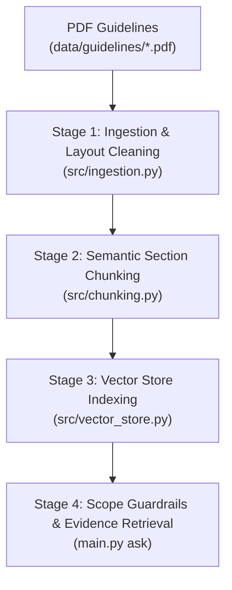

# Clinical Practice Guidelines RAG Pipeline

A lightweight, layout-aware Retrieval-Augmented Generation (RAG) system engineered to ingest, clean, chunk, index, and query official clinical practice guidelines (e.g., **NICE Guideline NG259**, **USPSTF Osteoporosis Screening Recommendations**). It delivers evidence-grounded clinical excerpts with source document citations, section metadata, and similarity confidence scores.

---

## 📋 Project Overview

- **Functionality**: Extracts clinical practice guidelines from PDF documents, removes non-content layout noise (headers, footers, page numbering, copyright lines, and DOI metadata) using layout detection, splits text into section-bounded semantic chunks, indexes them into a local vector store, and evaluates queries against clinical scope guardrails to return ranked evidence passages.
- **Hackathon Context**: Developed for the **AI Hackathon 2026** to provide trustworthy, transparent, and verifiable clinical decision support with explicit source lineage.

---

## 🏗️ Architecture

The system consists of four sequential stages implemented across modular components:



| Stage | Implementation File | Primary Functions & Role |
| :--- | :--- | :--- |
| **1. Ingestion & Cleaning** | [`src/ingestion.py`](file:///E:/Nadod/AI%20Hackathon/src/ingestion.py) | `extract_and_clean_pdf()`: Extracts text via `unstructured.partition_pdf()`, filters out `Header`/`Footer`/`PageBreak` elements, maps text to `Page` dataclasses, detects scanned PDFs, and writes cleaned `.txt` files to disk. |
| **2. Section Chunking** | [`src/chunking.py`](file:///E:/Nadod/AI%20Hackathon/src/chunking.py) | `chunk_document()`: Splits cleaned guideline text into `Chunk` objects bounded by section headers with configurable character sizes, overlaps, and token estimates. |
| **3. Vector Indexing** | [`src/vector_store.py`](file:///E:/Nadod/AI%20Hackathon/src/vector_store.py) | `VectorStore`: Builds an offline TF-IDF term vector index with cosine similarity search and serializes index state to `data/vector_store/index.json`. |
| **4. Query & Guardrails** | [`main.py`](file:///E:/Nadod/AI%20Hackathon/main.py) | `execute_ask()` & `check_scope_guardrail()`: Validates query domain relevance against a clinical keyword whitelist, searches the vector index, and renders the ranked Evidence Panel. |

---

## 📁 Project Structure

```text
├── data/
│   ├── guidelines/        # Source PDF guideline documents (e.g. NICE NG259, USPSTF)
│   ├── cleaned/           # Cleaned plain text files (*.txt)
│   └── vector_store/      # Serialized vector index (index.json)
├── src/
│   ├── __init__.py        # Public package API exports
│   ├── config.py          # Centralized configuration (paths, chunk limits, guardrail keywords)
│   ├── ingestion.py       # PDF layout extraction, element cleaning & Page contract
│   ├── chunking.py        # Semantic section chunker & Chunk dataclass
│   └── vector_store.py    # Local VectorStore (TF-IDF, term indexing & similarity search)
├── tests/
│   ├── __init__.py        # Test package root
│   └── test_pipeline.py   # Pytest unit test suite (11 passing tests)
├── requirements.txt       # Python package dependencies
├── .gitignore             # Git ignore rules for virtualenvs, caches, and OS files
├── main.py                # Unified CLI entrypoint (clean, build, ask)
├── run_checks.py          # Standalone end-to-end verification script
└── README.md              # Project documentation
```

---

## ⚙️ Setup & Installation

### 1. Requirements

Install Python dependencies:

```bash
pip install -r requirements.txt
```

### 2. Dependency Breakdown ([`requirements.txt`](file:///E:/Nadod/AI%20Hackathon/requirements.txt))
- **`unstructured[pdf]>=0.14.0`**: Core PDF layout detection and element classification.
- **`pytest>=8.0.0`**: Unit test runner.
- **`pytest-cov>=5.0.0`**: Test coverage reporting.

### 3. System Dependencies (Optional for Scanned PDFs)
- For native digital PDFs, extraction operates out of the box with zero OS dependencies.
- For high-resolution scanned document OCR (`--strategy hi_res`):
  - **Poppler** (`pdftoppm`): Windows: `winget install poppler` | Linux: `sudo apt-get install poppler-utils`
  - **Tesseract-OCR**: Windows: `winget install tesseract-ocr` | Linux: `sudo apt-get install tesseract-ocr`

### 4. Verify Installation

```bash
python main.py -h
pytest tests/test_pipeline.py -v
```

---

## 💻 CLI Usage

All pipeline commands are invoked through [`main.py`](file:///E:/Nadod/AI%20Hackathon/main.py):

### 1. Ingest & Clean Guidelines (`clean`)
Extracts text from PDF guidelines, filters out layout artifacts, writes `.txt` files to `data/cleaned/`, and prints a character reduction summary table.

**Syntax:**
```bash
python main.py clean [--academic [ACADEMIC]] [--input-dir INPUT_DIR] [--output-dir OUTPUT_DIR] [--strategy {fast,hi_res}]
```

**Example:**
```bash
python main.py clean
```

**Sample Output:**
```text
========================================================================================
  RAG PIPELINE: UNSTRUCTURED INGESTION & CLEANING (2 PDF DOCUMENTS)
========================================================================================
DOCUMENT NAME                                    | EST. RAW   | CLEAN CHARS | DROP (%)
----------------------------------------------------------------------------------------
osteoporosis-risk-assessment-pdf-66144025463749  | 19731      | 16443       | 16.7   %
osteoporosis-screening-final-recommendation      | 12532      | 10444       | 16.7   %
========================================================================================
TOTAL                                            | 32263      | 26887       | 16.7   %
========================================================================================

[OK] All cleaned files successfully written to: 'data/cleaned/'
```

---

### 2. Build Vector Index (`build`)
Reads cleaned text files from `data/cleaned/`, breaks text into section-aware chunks, builds the TF-IDF vector index, and saves it to disk.

**Syntax:**
```bash
python main.py build [--input-dir INPUT_DIR] [--index-path INDEX_PATH] [--chunk-size CHUNK_SIZE] [--overlap OVERLAP]
```

**Example:**
```bash
python main.py build
```

**Sample Output:**
```text
================================================================================
  RAG PIPELINE: BUILDING VECTOR INDEX FROM 'data/cleaned'
================================================================================
  -> osteoporosis-risk-assessment-pdf-66144025463749 |  16443 chars |  40 chunks
  -> osteoporosis-screening-final-recommendation   |  10444 chars |  14 chunks
--------------------------------------------------------------------------------
  Indexed 2 documents into 54 semantic chunks (54 vectors).
  Index saved to: 'data/vector_store/index.json'
================================================================================
[OK] Vector index build complete.
```

---

### 3. Ask Clinical Questions (`ask`)
Evaluates queries against clinical scope guardrails and retrieves ranked evidence passages from the vector store.

**Syntax:**
```bash
python main.py ask "QUERY" [--index-path INDEX_PATH] [--top-k TOP_K]
```

**In-Scope Example:**
```bash
python main.py ask "When should a DXA bone density scan be offered?"
```

**Sample Output:**
```text
================================================================================
  CLINICAL RAG QUERY: "When should a DXA bone density scan be offered?"
================================================================================

[GUARDRAIL APPROVED] (In-scope query matching keywords: bone, density, dxa)
[RETRIEVAL] Found 3 relevant guideline passages

--------------------------------------------------------------------------------
  EVIDENCE PANEL
--------------------------------------------------------------------------------

[Source #1] Document: osteoporosis-risk-assessment-pdf-66144025463749
           Section : 1.4 Bone density assessment
           Score   : 0.2811
           Excerpt :
             Bone mineral density (BMD) measurement with a dual-energy X-ray absorptiometry (DXA) scan
             
             1.4.1 Offer a DXA scan to measure BMD (with or without completing a risk prediction tool) when assessing fragility fracture risk in people aged 30 and over who have had:
             - a previous hip or vertebral fragility fracture or
             - a single major osteoporotic fragility fracture in the last 2 years or
             - 2 or more fragility fractures.

================================================================================
  CLINICAL GUIDELINE SYNTHESIS
================================================================================

Based on osteoporosis-risk-assessment-pdf-66144025463749 (1.4 Bone density assessment):

Bone mineral density (BMD) measurement with a dual-energy X-ray absorptiometry (DXA) scan:
1.4.1 Offer a DXA scan to measure BMD (with or without completing a risk prediction tool) when assessing fragility fracture risk in people aged 30 and over who have had:
- A previous hip or vertebral fragility fracture,
- A single major osteoporotic fragility fracture in the last 2 years, or
- 2 or more fragility fractures.
================================================================================
```

**Out-of-Scope Example:**
```bash
python main.py ask "How do I repair a car engine?"
```

**Sample Output:**
```text
================================================================================
  CLINICAL RAG QUERY: "How do I repair a car engine?"
================================================================================

[GUARDRAIL REJECTED]
  [GUARDRAIL NOTICE] Query is OUT OF SCOPE. This clinical RAG system specializes in osteoporosis risk assessment, screening, bone mineral density (DXA), and fracture prevention guidelines. Please submit a clinical or bone health question.

================================================================================
```

---

## 📊 Data & Metadata Schema

### 1. `Page` Schema ([`src/ingestion.py`](file:///E:/Nadod/AI%20Hackathon/src/ingestion.py))
Standard dataclass representing layout-extracted pages:
- `page_number: int`: 1-indexed document page number.
- `text: str`: Extracted and cleaned text content for the page.
- `elements: List[Dict[str, Any]]`: List of element dicts (`{"type": str, "text": str}`).
- `metadata: Dict[str, Any]`: Extraction engine and source file path metadata (`{"engine": "unstructured", "pdf_path": str}`).

### 2. `Chunk` Schema ([`src/chunking.py`](file:///E:/Nadod/AI%20Hackathon/src/chunking.py))
Standard dataclass representing segmented text passages:
- `chunk_id: str`: Unique identifier formatted as `{document_id}_chk_{chunk_idx:03d}`.
- `document_id: str`: Base name of source document (e.g. `osteoporosis-risk-assessment-pdf-66144025463749`).
- `section_title: str`: Nearest preceding section heading or `"General Overview"`.
- `text: str`: Cleaned text content of the chunk.
- `token_estimate: int`: Approximate token count computed as `len(text.split())`.
- `metadata: Dict[str, Any]`: Explicit metadata dictionary:
  - `"char_count": int`: Character length of the chunk.
  - `"document_id": str`: Source document ID.
  - `"section": str`: Section heading.

---

## ⚙️ Configuration Reference ([`src/config.py`](file:///E:/Nadod/AI%20Hackathon/src/config.py))

| Setting Constant | Default Value | Description |
| :--- | :--- | :--- |
| `BASE_DIR` | `Path(__file__).resolve().parent.parent` | Absolute path to the repository root directory. |
| `DATA_DIR` | `BASE_DIR / "data"` | Root data directory. |
| `DEFAULT_GUIDELINES_DIR` | `DATA_DIR / "guidelines"` | Source directory for input guideline PDF files. |
| `DEFAULT_CLEANED_DIR` | `DATA_DIR / "cleaned"` | Destination directory for cleaned plain text files. |
| `DEFAULT_VECTOR_STORE_DIR` | `DATA_DIR / "vector_store"` | Storage directory for vector index artifacts. |
| `DEFAULT_INDEX_PATH` | `DEFAULT_VECTOR_STORE_DIR / "index.json"` | Full path to serialized JSON vector store. |
| `SCANNED_DOC_MIN_CHARS` | `50` | Character threshold under which a document is flagged as a scanned image. |
| `DEFAULT_PARTITION_STRATEGY`| `"fast"` | Ingestion strategy for Unstructured (`"fast"` or `"hi_res"`). |
| `DEFAULT_CHUNK_SIZE_CHARS` | `600` | Target maximum character length per semantic chunk. |
| `DEFAULT_CHUNK_OVERLAP_CHARS`| `100` | Character overlap between consecutive chunks. |
| `DEFAULT_RETRIEVAL_TOP_K` | `3` | Number of ranked evidence passages retrieved per query. |
| `CLINICAL_KEYWORDS` | `set([...])` | Whitelist of 33 clinical terms used for query guardrail validation. |

---

## 🧪 Testing

Run the test suite via `pytest`:

```bash
pytest tests/test_pipeline.py -v
```

### Test Suite Coverage ([`tests/test_pipeline.py`](file:///E:/Nadod/AI%20Hackathon/tests/test_pipeline.py)):
1. `test_page_dataclass_contract`: Verifies `Page` dataclass attributes, element typing, and metadata storage.
2. `test_page_dataclass_defaults`: Confirms default empty lists and dictionaries are isolated per instance.
3. `test_element_filtering_logic`: Confirms layout `Header`, `Footer`, and `PageBreak` elements are dropped while `Title`, `NarrativeText`, and `ListItem` are preserved.
4. `test_missing_file_raises_file_not_found`: Verifies `partition_and_filter_pdf` raises `FileNotFoundError` for missing paths.
5. `test_save_cleaned_text`: Validates atomic UTF-8 text file writes to disk.
6. `test_format_summary_table`: Validates column headers, formatting, and character count totals in ASCII tables.
7. `test_clean_all_guidelines_empty_dir`: Confirms `clean_all_guidelines` handles empty input directories gracefully.
8. `test_scanned_pdf_detection`: Validates heuristic detection and warning flags for scanned/image-only PDFs.
9. `test_chunk_document_basic`: Verifies section-bounded chunk generation and token estimation.
10. `test_vector_store_search`: Confirms TF-IDF vector index building, term weighting, and ranked cosine similarity search.
11. `test_scope_guardrails`: Validates acceptance of clinical queries and rejection of out-of-scope non-medical queries.

---

## ⚠️ Known Limitations & Current Scope

1. **Local TF-IDF Vector Retrieval**: Uses an offline, pure-Python TF-IDF index with cosine similarity. It does not use dense transformer embeddings (e.g. HuggingFace / OpenAI embeddings), making it fast and dependency-free, but dependent on lexical overlap.
2. **Generative LLM Synthesis**: The synthesis step currently presents the top retrieved guideline recommendation excerpt directly with source lineage rather than calling an external LLM API (OpenAI / Anthropic / Gemini).
3. **Scanned Image PDFs**: Defaults to `strategy="fast"`. Image-only or non-digital PDFs require system-level `tesseract-ocr` and `poppler` binaries to run full OCR via `--strategy hi_res`.
