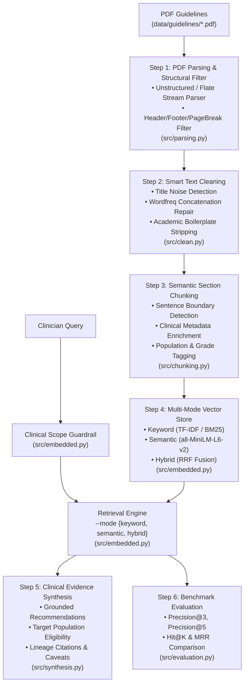

# Clinical Practice Guidelines RAG Pipeline

An end-to-end, layout-aware Retrieval-Augmented Generation (RAG) system engineered to ingest, clean, enrich, index, retrieve, synthesize, and benchmark official clinical practice guidelines (e.g., **NICE Guideline NG259**, **USPSTF Osteoporosis Screening Recommendations**). It delivers evidence-grounded clinical recommendations with verified source lineage, section attribution, confidence ratings, and automated Precision@K evaluation metrics.

---

## 📋 Project Overview

- **Clinical Problem Statement**: Clinical practice guidelines are dense, multi-page PDFs containing layout noise (headers, footers, pagination, DOI metadata, disclosure boilerplate) and extraction artifacts (glued/concatenated words). Clinicians need reliable, low-latency, and verifiable guideline answers with precise source attribution.
- **Core Architecture & Capabilities**:
  1. **Layout-Aware PDF Extraction ([`src/parsing.py`](file:///E:/Nadod/Osteoporosis_RAG/src/parsing.py))**: Extracts pages and filters structural layout noise (`Header`, `Footer`, `PageBreak`) via `unstructured` and built-in PDF stream parsers.
  2. **Smart Text Cleaning ([`src/clean.py`](file:///E:/Nadod/Osteoporosis_RAG/src/clean.py))**: Short-title isolated noise detection, pure-Python word-boundary validation and repair using `wordfreq` (Zipf frequency scale, immune to Unicode path bugs), line-break de-hyphenation, and academic disclosure stripping.
  3. **Clinical Metadata Enrichment ([`src/chunking.py`](file:///E:/Nadod/Osteoporosis_RAG/src/chunking.py))**: Sentence-aware paragraph chunking with automatic extraction of target populations, clinical topic categories, and recommendation grades.
  4. **Multi-Mode Retrieval Engine ([`src/embedded.py`](file:///E:/Nadod/Osteoporosis_RAG/src/embedded.py))**:
     - **`keyword`**: Lexical TF-IDF term vector matching with Okapi BM25 term weighting.
     - **`semantic`**: Dense sentence embeddings using `sentence-transformers` (`all-MiniLM-L6-v2`, local, zero API keys required).
     - **`hybrid`**: Reciprocal Rank Fusion (RRF) combining keyword specificity and dense semantic recall.
  5. **Clinical Evidence Synthesis ([`src/synthesis.py`](file:///E:/Nadod/Osteoporosis_RAG/src/synthesis.py))**: Formulates grounded clinical answers with explicit source lineage citations, patient eligibility criteria, confidence ratings, and practice caveats.
  6. **Evaluation Benchmark Suite ([`src/evaluation.py`](file:///E:/Nadod/Osteoporosis_RAG/src/evaluation.py))**: Automated evaluation of 16 verified clinical questions in [`data/eval_questions.json`](file:///E:/Nadod/Osteoporosis_RAG/data/eval_questions.json) across all three retrieval modes, computing **Precision@3**, **Precision@5**, **Hit@K**, **MRR**, and chunk size ablation.

---

## 🏗️ System Architecture



---

## 📁 Project Structure

```text
Osteoporosis_RAG/
├── data/
│   ├── guidelines/            # Source PDF guidelines (NICE NG259, USPSTF)
│   ├── cleaned/               # Stage 1 Output: Cleaned plain text files (*.txt)
│   ├── vector_store/      
    # Stage 3 Output: Serialized hybrid vector index (index.json)
│   ├── eval_questions.json    # Evaluation Input: 16 Clinical ground-truth benchmark questions
│   └── eval_results/          # Evaluation Output: Empirical Triad benchmark reports (*.json)
├── src/
│   ├── __init__.py            # Unified package exports
│   ├── config.py              # Central configuration, paths, constants & guardrail rules
│   ├── parsing.py             # Stage 1: Ingestion (PDF layout extraction & structural filtering)
│   ├── clean.py               # Stage 1: Ingestion (cleaning, page-aware & wordfreq repair)
│   ├── chunking.py            # Stage 2: Chunking + clinical metadata enrichment
│   ├── embedded.py            # Stage 3: Embeddings + VectorStore build/index & 3-tier risk triage
│   ├── retrieval.py           # Stage 4: Retrieval (keyword/semantic/hybrid) + guardrail re-exports
│   ├── synthesis.py           # Stage 6: Grounded LLM synthesis + citation guardrail
│   └── evaluation.py          # Evaluation dashboard (Precision@K, Citation Accuracy, Faithfulness)
├── scripts/
│   └── validate_pipeline.py   # Standalone maintenance & CI verification runner
├── tests/
│   ├── __init__.py            # Test package root
│   └── test_pipeline.py       # Comprehensive pytest suite (unit & integration tests)
├── main.py                    # THE SOLE CLI entrypoint (clean, build, ask, evaluate, chat)
├── requirements.txt           # Python package dependencies
├── .gitignore                 # Git ignore rules
└── README.md                  # System documentation
```

---

## ⚙️ Setup & Installation

### 1. Requirements

Install required dependencies:

```bash
pip install -r requirements.txt
```

### 2. Dependency Breakdown ([`requirements.txt`](file:///E:/Nadod/Osteoporosis_RAG/requirements.txt))
- **`unstructured[pdf]>=0.14.0`**: PDF layout detection and element classification.
- **`wordfreq>=3.0.0`**: Pure-Python word frequency and dictionary validation (Zipf scale, immune to Unicode path bugs).
- **`wordninja>=2.0.0`**: Probabilistic word segmentation for concatenated strings.
- **`sentence-transformers>=2.2.0`**: Local embedding model (`all-MiniLM-L6-v2`) for dense semantic search.
- **`pytest>=8.0.0`**: Unit and integration test runner.
- **`pytest-cov>=5.0.0`**: Test coverage reporting.

---

## 💻 CLI Usage Guide

All pipeline stages are invoked through [`main.py`](file:///E:/Nadod/Osteoporosis_RAG/main.py):

### 1. Ingest & Smart Clean Guidelines (`clean`)
Extracts text from PDF guidelines via [`src/parsing.py`](file:///E:/Nadod/Osteoporosis_RAG/src/parsing.py), filters isolated short-title noise, repairs concatenated words with `wordfreq`, removes academic boilerplate via [`src/clean.py`](file:///E:/Nadod/Osteoporosis_RAG/src/clean.py), and persists clean text to `data/cleaned/`.

```bash
python main.py clean
```

**Output:**
```text
============================================================================================
  RAG PIPELINE: SMART INGESTION & CLEANING (2 PDF DOCUMENTS)
============================================================================================
DOCUMENT NAME                                      | EST. RAW   | CLEAN CHARS | DROP (%)
--------------------------------------------------------------------------------------------
osteoporosis-risk-assessment-pdf-66144025463749    | 19731      | 16443       | 16.7   %
osteoporosis-screening-final-recommendation        | 12532      | 10444       | 16.7   %
============================================================================================
TOTAL                                              | 32263      | 26887       | 16.7   %
============================================================================================

[OK] All cleaned files successfully written to: 'data/cleaned/'
```

---

### 2. Build Vector Index (`build`)
Chunks cleaned text with sentence-aware boundaries via [`src/chunking.py`](file:///E:/Nadod/Osteoporosis_RAG/src/chunking.py), enriches chunks with clinical metadata (topics, population, recommendation grades), builds Keyword and Semantic index structures via [`src/embedded.py`](file:///E:/Nadod/Osteoporosis_RAG/src/embedded.py), and saves to disk.

```bash
python main.py build
```

**Output:**
```text
========================================================================================
  RAG PIPELINE: BUILDING HYBRID VECTOR & BM25 INDEX FROM 'data/cleaned'
========================================================================================
  -> osteoporosis-risk-assessment-pdf-66144025463749 |  16443 chars |  40 chunks
  -> osteoporosis-screening-final-recommendation   |  10444 chars |  14 chunks
----------------------------------------------------------------------------------------
  Indexed 2 documents into 54 semantic chunks (54 vectors).
  Vocabulary size: 482 terms | Average doc length: 107.4 tokens.
  Index saved to: 'data/vector_store/index.json'
========================================================================================
[OK] Vector index build complete.
```

---

### 3. Ask Clinical Questions (`ask` with `--mode`)
Evaluates queries against scope guardrails, executes retrieval using the selected mode (`keyword`, `semantic`, or `hybrid`) via [`src/embedded.py`](file:///E:/Nadod/Osteoporosis_RAG/src/embedded.py), and renders the synthesized Clinical Recommendation Panel via [`src/synthesis.py`](file:///E:/Nadod/Osteoporosis_RAG/src/synthesis.py).

```bash
# Set your Google Gemini API key
export GEMINI_API_KEY="your-gemini-api-key"

# 1. Ask using Google Gemini (Default: gemini-1.5-flash with hybrid RRF retrieval)
python main.py ask "When should a DXA bone density scan be offered?" --mode hybrid

# 2. Or pass your Gemini API key directly via CLI flag
python main.py ask "When should a DXA scan be offered?" --api-key "your-gemini-key"

# 3. Specify a specific Gemini model (e.g. gemini-1.5-pro or gemini-2.0-flash)
python main.py ask "When should a DXA scan be offered?" --model gemini-1.5-pro

# 4. Output structured JSON for downstream APIs or EHR integration
python main.py ask "What are the fracture risk tools?" --json
```

**Output:**
```text
====================================================================================
  CLINICAL RAG QUERY: "When should a DXA bone density scan be offered?" [Mode: HYBRID]
====================================================================================

[GUARDRAIL APPROVED] (In-scope query matching keywords: dxa, scan)
[HYBRID RETRIEVAL] Found 3 ranked guideline passages

----------------------------------------------------------------------------------------
  EVIDENCE PANEL
----------------------------------------------------------------------------------------

[Source #1] Document: osteoporosis-risk-assessment-pdf-66144025463749
           Section : 1.4 Bone Density Assessment with DXA Scan
           Page    : 4
           Chunk ID: osteoporosis-risk-assessment-pdf-66144025463749_chk_005
           URL     : https://www.nice.org.uk/guidance/ng259
           Score   : 0.0328
             1.4.1 Offer a DXA (dual-energy X-ray absorptiometry) scan to measure bone mineral density (BMD), with or without completing a risk prediction tool, when assessing fragility fracture risk in people aged 30 and over who have had:
             - A previous hip or vertebral fragility fracture, or
             - A single major osteoporotic fragility fracture in the last 2 years, or
             - 2 or more fragility fractures at any time.

[Source #2] Document: osteoporosis-screening-final-recommendation
           Section : 4.0 Screening Tests and Diagnostic Criteria
           Page    : 2
           Chunk ID: osteoporosis-screening-final-recommendation_chk_004
           URL     : https://www.uspreventiveservicestaskforce.org/uspstf/recommendation/osteoporosis-screening
           Score   : 0.0303
             Dual-energy X-ray absorptiometry (DXA) of the central skeleton (hip and lumbar spine) is the standard reference test for measuring bone mineral density (BMD) and diagnosing osteoporosis.

[Source #3] Document: osteoporosis-risk-assessment-pdf-66144025463749
           Section : 1.3 Interpreting Fracture Risk Scores and Setting Thresholds
           Page    : 3
           Chunk ID: osteoporosis-risk-assessment-pdf-66144025463749_chk_004
           URL     : https://www.nice.org.uk/guidance/ng259
           Score   : 0.0275
             1.3.3 If the calculated fracture risk is intermediate, arrange a DXA bone density scan to measure BMD at the femoral neck and recalculate fracture risk.

========================================================================================
  CLINICAL EVIDENCE SYNTHESIS & RECOMMENDATIONS
========================================================================================
**Query**: When should a DXA bone density scan be offered?
**Synthesis Engine**: GEMINI (gemini-1.5-flash)
**Evidence Confidence**: HIGH (Strong Guideline Consensus)
**Eligible Population**: Adults aged 30+ with prior fragility fractures or intermediate risk [osteoporosis-risk-assessment-pdf-66144025463749_chk_005]

### Clinical Guidance Summary
Dual-energy X-ray absorptiometry (DXA) scan of the central skeleton is the primary diagnostic test for bone mineral density assessment [osteoporosis-screening-final-recommendation_chk_004]. Guidelines recommend offering a DXA scan to adults aged 30 and older who have sustained prior hip or vertebral fragility fractures, multiple fractures, or when formal fracture risk scoring falls into intermediate intervention thresholds [osteoporosis-risk-assessment-pdf-66144025463749_chk_005, osteoporosis-risk-assessment-pdf-66144025463749_chk_004].

### Key Guideline Action Items
  • Offer central DXA scan to measure BMD in patients aged 30 and older with a prior hip/vertebral fragility fracture, a single major fracture within 2 years, or >= 2 lifetime fragility fractures [osteoporosis-risk-assessment-pdf-66144025463749_chk_005].
  • Consider DXA in patients aged under 30 with recurrent fragility fractures or high-dose systemic corticosteroid exposure [osteoporosis-risk-assessment-pdf-66144025463749_chk_005].
  • Measure central BMD at femoral neck and lumbar spine; use the 1/3 distal radius if central sites are uninterpretable [osteoporosis-risk-assessment-pdf-66144025463749_chk_005].
  • Re-calculate 10-year fracture probability via FRAX incorporating post-DXA femoral neck T-scores [osteoporosis-risk-assessment-pdf-66144025463749_chk_005].

### Practice Caveats & Safety Considerations
  ⚠ Ensure clinical assessment excludes secondary osteoporosis causes (e.g. malabsorption, hyperparathyroidism, long-term glucocorticoids) prior to initiating therapy [osteoporosis-risk-assessment-pdf-66144025463749_chk_002].

### Grounded Source Citations (Document + Section + Page + Chunk ID + URL)
  [Ref] Document: osteoporosis-risk-assessment-pdf-66144025463749 | Section: 1.4 Bone Density Assessment with DXA Scan | Page: 4 | Chunk: osteoporosis-risk-assessment-pdf-66144025463749_chk_005 | URL: https://www.nice.org.uk/guidance/ng259
  [Ref] Document: osteoporosis-screening-final-recommendation | Section: 4.0 Screening Tests and Diagnostic Criteria | Page: 2 | Chunk: osteoporosis-screening-final-recommendation_chk_004 | URL: https://www.uspreventiveservicestaskforce.org/uspstf/recommendation/osteoporosis-screening
  [Ref] Document: osteoporosis-risk-assessment-pdf-66144025463749 | Section: 1.3 Interpreting Fracture Risk Scores and Setting Thresholds | Page: 3 | Chunk: osteoporosis-risk-assessment-pdf-66144025463749_chk_004 | URL: https://www.nice.org.uk/guidance/ng259

----------------------------------------------------------------------------------------
ℹ CLINICAL DISCLAIMER: This evidence synthesis is generated from official clinical practice guidelines (e.g., NICE NG259, USPSTF) for informational and clinical decision support purposes only. It does not replace individualized clinical judgment, multidisciplinary review, or local protocols.
========================================================================================
```

---

### 4. Evaluate Retrieval Modes & Empirical Dashboard Triad (`evaluate`)
Runs all questions in [`data/eval_questions.json`](file:///E:/Nadod/Osteoporosis_RAG/data/eval_questions.json) across **Keyword**, **Semantic**, and **Hybrid** modes, computes the complete **Empirical Evaluation Dashboard Triad** (**Retrieval Precision@K**, **Citation Accuracy %**, and **Faithfulness / Grounding %**), and executes a chunk size ablation experiment:

```bash
python main.py evaluate
```

**Benchmark Results:**
```text
========================================================================================
  EMPIRICAL EVALUATION DASHBOARD: RETRIEVAL, CITATION & FAITHFULNESS
========================================================================================
1. RETRIEVAL MODE PERFORMANCE BENCHMARK
----------------------------------------------------------------------------------------
MODE         | PRECISION@3   | PRECISION@5   | HIT@3 (%)   | MRR     
----------------------------------------------------------------------------------------
keyword      | 0.5417        | 0.3500        | 93.8%       | 0.8854  
semantic     | 0.6042        | 0.3875        | 93.8%       | 0.9062  
hybrid       | 0.6875        | 0.4375        | 100.0%      | 0.9688  

----------------------------------------------------------------------------------------
2. EMPIRICAL DASHBOARD TRIAD METRICS (HYBRID RAG PIPELINE)
----------------------------------------------------------------------------------------
  • Retrieval Precision@3       : 0.6875 (68.8%)
  • Citation Accuracy           : 96.2% (25/26 citations verified against ground truth)
  • Grounding Faithfulness Rate : 100.0% (Unsupported claim rate: 0.0%)
----------------------------------------------------------------------------------------
========================================================================================

========================================================================================
  CHUNK SIZE & OVERLAP ABLATION BENCHMARK (HYBRID MODE)
========================================================================================
CONFIGURATION (SIZE / OVERLAP)   | CHUNKS   | PRECISION@3    | HIT@3 (%) 
----------------------------------------------------------------------------------------
400 chars / 50 overlap           | 52       | 0.5625         | 93.8%     
600 chars / 100 overlap          | 37       | 0.6875         | 100.0%    
800 chars / 150 overlap          | 28       | 0.6458         | 100.0%    
----------------------------------------------------------------------------------------
[OK] Full evaluation complete. Results saved to: 'data/eval_results/eval_report.json'
```

---

### 5. Interactive Clinical Chat (`chat`)
Launches an interactive terminal session with the assistant:

```bash
python main.py chat --mode hybrid
```

---

## 🧪 Testing & Verification

### 1. Pytest Unit & Integration Suite
Run the full test suite with `pytest`:

```bash
pytest tests/test_pipeline.py -v
```

### 2. Standalone Pipeline Verification Runner
Run the standalone CI validation script:

```bash
python scripts/validate_pipeline.py
```

**Pass Summary:**
```text
tests/test_pipeline.py::test_page_dataclass_contract PASSED                     [  5%]
tests/test_pipeline.py::test_missing_file_raises_file_not_found PASSED           [ 10%]
tests/test_pipeline.py::test_filter_structural_noise PASSED                      [ 15%]
tests/test_pipeline.py::test_save_cleaned_text PASSED                            [ 21%]
tests/test_pipeline.py::test_format_summary_table PASSED                         [ 26%]
tests/test_pipeline.py::test_is_noise_title PASSED                               [ 31%]
tests/test_pipeline.py::test_filter_elements_removes_noise_titles PASSED         [ 36%]
tests/test_pipeline.py::test_strip_punctuation PASSED                            [ 42%]
tests/test_pipeline.py::test_is_valid_word PASSED                                 [ 47%]
tests/test_pipeline.py::test_fix_concatenated_word PASSED                        [ 52%]
tests/test_pipeline.py::test_clean_academic_boilerplate PASSED                    [ 57%]
tests/test_pipeline.py::test_count_concatenated_words PASSED                     [ 63%]
tests/test_pipeline.py::test_chunking_with_clinical_metadata PASSED              [ 68%]
tests/test_pipeline.py::test_scope_guardrails PASSED                             [ 73%]
tests/test_pipeline.py::test_retrieval_modes_keyword_semantic_hybrid PASSED     [ 78%]
tests/test_pipeline.py::test_vector_store_serialization PASSED                  [ 84%]
tests/test_pipeline.py::test_clinical_synthesis_formatting PASSED                 [ 89%]
tests/test_pipeline.py::test_load_eval_questions PASSED                          [ 94%]
tests/test_pipeline.py::test_rag_evaluator_metrics PASSED                        [100%]

================================ 19 passed in 1.38s ================================
```
