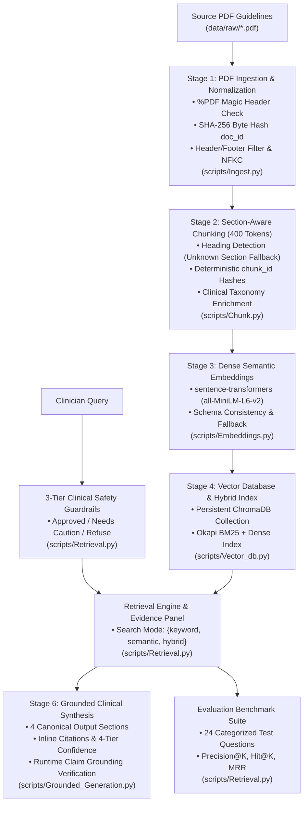

# Clinical Practice Guidelines RAG Pipeline

An end-to-end, layout-aware Retrieval-Augmented Generation (RAG) system engineered to ingest, clean, enrich, index, retrieve, synthesize, and benchmark official clinical practice guidelines (such as **NICE Guideline NG259** and **USPSTF Osteoporosis Screening Recommendations**). It delivers evidence-grounded clinical recommendations with verified source lineage, section attribution, confidence ratings, and automated Precision@K evaluation metrics.

---

## 📋 Project Overview

- **Clinical Problem Statement**: Clinical practice guidelines are dense, multi-page PDFs containing layout noise (headers, footers, pagination, DOI metadata, disclosure boilerplate) and extraction artifacts. Clinicians need reliable, low-latency, and verifiable guideline answers with precise source attribution, strict domain guardrails, and deterministic traceability.
- **Core Architecture & Capabilities**:
  1. **Layout-Aware PDF Ingestion ([`scripts/Ingest.py`](file:///E:/Nadod/Osteoporosis_RAG/scripts/Ingest.py))**: Ingests guideline PDFs from `data/raw/`, verifies `%PDF` magic bytes, computes content-based SHA-256 byte hashes for `document_id`, filters structural layout noise (`Header`, `Footer`, `PageBreak`), standardizes text with Unicode NFKC normalization and de-hyphenation, maps metadata via `data/sources.json`, and generates `data/processed/elements.json`.
  2. **Section-Aware Semantic Chunking ([`scripts/Chunk.py`](file:///E:/Nadod/Osteoporosis_RAG/scripts/Chunk.py))**: Performs 400-token chunking (`tiktoken` `cl100k_base`) with 50-token sliding overlap, detects section headings from layout elements/regex (defaulting explicitly to `"Unknown Section"`), generates deterministic content-based `chunk_id` hashes from `(document_id + text + page_number)`, enriches clinical taxonomy (populations, clinical topics, issuer), and saves `data/processed/chunks.json`.
  3. **Dense Semantic Embeddings ([`scripts/Embeddings.py`](file:///E:/Nadod/Osteoporosis_RAG/scripts/Embeddings.py))**: Encodes chunks into 384-dimensional dense vectors using open-source `sentence-transformers` (`all-MiniLM-L6-v2`) with deterministic fallback, preserving identical metadata schemas in `data/processed/embeddings.json`.
  4. **Persistent Vector Database & Indexing ([`scripts/Vector_db.py`](file:///E:/Nadod/Osteoporosis_RAG/scripts/Vector_db.py))**: Stores vectors in a persistent ChromaDB collection at `data/processed/chroma_db/` and builds a hybrid Okapi BM25 + Dense Semantic index in `data/processed/index.json`.
  5. **Multi-Mode Retrieval Engine & Benchmark ([`scripts/Retrieval.py`](file:///E:/Nadod/Osteoporosis_RAG/scripts/Retrieval.py))**: Supports Keyword (BM25), Semantic (Dense), and Hybrid (RRF) retrieval with 3-tier clinical safety guardrails, Pre-Generation Evidence Panels, and Precision@K / MRR benchmark evaluation against `data/eval_questions.json`.
  6. **Grounded Clinical Generation & Claim Verification ([`scripts/Grounded_Generation.py`](file:///E:/Nadod/Osteoporosis_RAG/scripts/Grounded_Generation.py))**: Produces structured 4-section clinical reports with inline citations, 4-tier confidence scoring, retrieval confidence score gating (`< 0.015` returns Insufficient Evidence), and post-processing lexical overlap claim grounding verification.

---

## 🏗️ System Architecture



---

## 📁 Project Structure

```text
Osteoporosis_RAG/
├── .env                              # Environment configuration (paths, models, thresholds)
├── requirements.txt                  # Python dependencies (sentence-transformers, chromadb, etc.)
├── README.md                         # System documentation
├── main.py                           # Single CLI entrypoint (runs pipeline end-to-end or by stage)
├── run_pipeline_checks.py            # Backward compatibility test runner
├── data/
│   ├── sources.json                  # Source registry mapping documents to official URLs and metadata
│   ├── eval_questions.json           # 24 labeled, categorized clinical benchmark questions
│   ├── raw/                          # Source clinical guideline PDFs (NICE NG259, USPSTF)
│   └── processed/                    # Canonical data artifacts
│       ├── elements.json             # Stage 1: Extracted layout elements with element_ids
│       ├── chunks.json               # Stage 2: 400-token semantic chunks with clinical taxonomy
│       ├── embeddings.json           # Stage 3: Dense vector embeddings with consistent schema
│       ├── index.json                # Stage 4: Consolidated BM25 + Vector retrieval index
│       └── chroma_db/                # Stage 4: Persistent ChromaDB vector database
├── src/
│   ├── schema.py                     # Core data models (Chunk, Page, ClinicalSynthesisResponse, EvalQuestion, ConfidenceTier)
│   └── utils.py                      # Shared text processing & hashing (compute_content_hash, clean_text, count_tokens)
├── scripts/
│   ├── __init__.py                   # Package initialization & stage exports
│   ├── Ingest.py                     # Stage 1: PDF Ingestion & Layout Element Extraction
│   ├── Chunk.py                      # Stage 2: Section-Aware Semantic Chunking & Metadata Enrichment
│   ├── Embeddings.py                 # Stage 3: Dense Semantic Embedding Generation
│   ├── Vector_db.py                  # Stage 4: Vector Database Store & Hybrid Indexer
│   ├── Retrieval.py                  # Stage 5: Multi-Mode Retrieval Engine & Benchmark Evaluator
│   ├── Grounded_Generation.py        # Stage 6: Grounded Clinical Generation & Claim Grounding Verification
│   └── validate_pipeline.py          # Standalone architectural validator (8 comprehensive test checks)
└── tests/
    ├── __init__.py                   # Test package marker
    └── test_pipeline.py              # Comprehensive pytest suite
```

---

## 🛡️ Core Standards & Identifiers

### 1. Unified Hashing Standard ([`src/utils.py`](file:///E:/Nadod/Osteoporosis_RAG/src/utils.py))
All identifiers across the pipeline are generated using the single shared function `compute_content_hash(*parts, length=12)`:
- **`document_id`**: Content hash computed from the PDF's **file bytes** (first 12 hex characters of SHA-256). Invariant to file renames.
- **`document_name`**: Human-readable filename stem, kept as a separate field.
- **`chunk_id`**: Formatted as `{document_id}_chk_{hash}` from `(document_id + text + page_number)`. Guarantees deterministic citations across runs.
- **`element_id`**: Formatted as a content hash from `(document_id + page_number + element_index + text)`.

### 2. Section Detection & Fallback Standard
- Derived from layout `Title` / `Header` elements with numbered heading regex fallback (`r'^(?:\d+\.[\d\.]*\s+[A-Z]...)'`).
- If no heading is detected, `section_title` is explicitly set to `"Unknown Section"` so schema keys are identical across all records.

### 3. Dynamic Source Loading (`data/sources.json`)
- `Ingest.py` dynamically loads guideline source URLs and publisher metadata from `data/sources.json`.
- If a document has no configured entry, a clear warning is logged (`[WARN] No source_url configured for <filename> in data/sources.json`).

### 4. File Integrity Validation
- `verify_pdf_integrity(pdf_path)` inspects `%PDF` magic bytes before opening any file, logging explicit errors for non-PDF or corrupted files.

### 5. 3-Tier Clinical Safety Guardrails
- **`approved`**: Standard clinical practice guideline questions.
- **`needs_caution`**: Queries asking for patient-specific prescriptions or direct medical intervention without clinician oversight.
- **`refuse_redirect`**: Acute medical emergencies (cardiac arrest, chest pain, stroke) or non-medical out-of-scope queries (mechanical repair, recipes, etc.).

### 6. Canonical 4-Tier Confidence Rating
- **`High`**: Retrieval similarity score $\ge 0.60$
- **`Medium`**: Retrieval similarity score $\ge 0.30$
- **`Low`**: Retrieval similarity score $\ge 0.015$
- **`Insufficient Evidence`**: Retrieval similarity score $< 0.015$ (generation is withheld to prevent hallucination).

---

## 📊 Consistent Metadata Schema

Every record across `elements.json`, `chunks.json`, and `embeddings.json` maintains consistent, fully-populated fields:

| Field | Description | Example |
| :--- | :--- | :--- |
| `document_id` | SHA-256 byte hash of raw PDF | `"9df46d5cbe98"` |
| `document_name` | Filename stem | `"osteoporosis-risk-assessment-pdf-66144025463749"` |
| `section_title` | Detected heading or fallback | `"1.1 Risk factors for fragility fractures"` |
| `page_number` | 1-indexed document page | `5` |
| `chunk_id` | Deterministic content hash | `"9df46d5cbe98_chk_78a16fb0"` |
| `source_url` | Official guideline link | `"https://www.nice.org.uk/guidance/ng259"` |
| `token_estimate` | `cl100k_base` token count | `424` |
| `metadata` | Clinical topics, population, issuer | `{"topics": ["Screening & Diagnosis"], "guideline_issuer": "NICE"}` |

---

## ⚙️ Setup & Installation

### 1. Requirements

Install required dependencies:

```bash
pip install -r requirements.txt
```

### 2. Environment Configuration (`.env`)

```ini
RAW_DATA_DIR=data/raw
PROCESSED_DATA_DIR=data/processed
CHROMA_DB_DIR=data/processed/chroma_db
EVAL_QUESTIONS_PATH=data/eval_questions.json
EMBEDDING_MODEL_NAME=all-MiniLM-L6-v2
DEFAULT_CHUNK_SIZE_TOKENS=400
DEFAULT_CHUNK_OVERLAP_TOKENS=50
DEFAULT_RETRIEVAL_MODE=hybrid
DEFAULT_RETRIEVAL_TOP_K=3
MIN_SYNTHESIS_SCORE_THRESHOLD=0.015
CONFIDENCE_SCORE_HIGH=0.60
CONFIDENCE_SCORE_MEDIUM=0.30
CONFIDENCE_SCORE_LOW=0.015
DEFAULT_LLM_PROVIDER=gemini
DEFAULT_GEMINI_MODEL=gemini-1.5-flash
UNSUPPORTED_CLAIM_OVERLAP_THRESHOLD=0.25
```

---

## 💻 CLI Usage Guide

### 1. Run Full End-to-End Pipeline
Executes all 6 stages sequentially (Ingestion $\rightarrow$ Chunking $\rightarrow$ Embeddings $\rightarrow$ Vector DB $\rightarrow$ Retrieval $\rightarrow$ Grounded Generation):

```bash
python main.py
```

---

### 2. Run Individual Canonical Stage Scripts

Each script in `scripts/` is independently executable with its own summary output:

```bash
# Stage 1: Ingest PDFs from data/raw/ -> data/processed/elements.json
python scripts/Ingest.py

# Stage 2: 400-Token Chunking & Taxonomy -> data/processed/chunks.json
python scripts/Chunk.py

# Stage 3: Dense Sentence-Transformer Embeddings -> data/processed/embeddings.json
python scripts/Embeddings.py

# Stage 4: Persistent ChromaDB Vector Store & Index -> data/processed/chroma_db/
python scripts/Vector_db.py

# Stage 5: Multi-Mode Retrieval & Benchmark -> data/eval_questions.json
python scripts/Retrieval.py

# Stage 6: Grounded Clinical Synthesis with Citations & Verification
python scripts/Grounded_Generation.py "When should a central DXA bone density scan be offered according to NICE guidelines?"
```

---

### 3. Ask Clinical Questions via `main.py`

```bash
# Set your Google Gemini API key (optional; deterministic fallback active if unset)
export GEMINI_API_KEY="AQ.Ab8RN6IZmBMNovKVDDTtAesmMzcqVVSVCIUspNXLSQtWxnUNlg"

# Query the knowledge base using hybrid retrieval
python main.py ask "When should a central DXA scan be offered?" --mode hybrid --top-k 3
```

---

### 4. Interactive Clinician Chat Assistant

```bash
python main.py chat --mode hybrid --top-k 3
```

---

### 5. Architectural Validation & Pytest Suite

```bash
# Run standalone 8-point architectural pipeline validation
python scripts/validate_pipeline.py

# Run comprehensive pytest test suite
pytest tests/ -v
```

---

## 📈 Retrieval Evaluation & Multi-Configuration Comparison System

The system includes a comprehensive benchmark evaluation and comparison engine designed to systematically measure and compare different retrieval configurations across the 24 categorized clinical evaluation queries in [`data/eval_questions.json`](file:///E:/Nadod/Osteoporosis_RAG/data/eval_questions.json).

### 1. Evaluated Ranking & Information Retrieval Metrics

- **Precision@K**: Proportion of retrieved chunks that are relevant ground-truth recommendations:
  $$\text{Precision@}K = \frac{|\text{Retrieved}_K \cap \text{Expected}|}{K}$$
- **Recall@K**: Proportion of total expected ground-truth chunks successfully retrieved:
  $$\text{Recall@}K = \frac{|\text{Retrieved}_K \cap \text{Expected}|}{|\text{Expected}|}$$
- **Hit@K (Hit Rate)**: Binary indicator of whether at least one relevant passage is retrieved within the top $K$.
- **Mean Reciprocal Rank (MRR)**: Evaluates the rank position of the first relevant chunk:
  $$\text{MRR} = \frac{1}{|Q|} \sum_{q \in Q} \frac{1}{\text{rank}_1(q)}$$
- **Mean Average Precision (MAP@K)**: Measures rank-weighted precision across multi-chunk questions:
  $$\text{MAP@}K = \frac{1}{|Q|} \sum_{q \in Q} \text{AP@}K(q)$$
- **Normalized Discounted Cumulative Gain (NDCG@K)**: Evaluates graded relevance and position penalties:
  $$\text{NDCG@}K = \frac{\text{DCG@}K}{\text{IDCG@}K} \quad \text{where } \text{DCG@}K = \sum_{i=1}^K \frac{\mathbb{I}(c_i \in \text{Expected})}{\log_2(i + 1)}$$
- **Query Latency (ms)**: End-to-end execution time per retrieval query in milliseconds.
- **Safety Deflection Rate**: Percentage of acute emergencies (e.g. cardiac arrest, stroke) and out-of-scope queries deflected before search execution.

---

### 2. Multi-Configuration Comparison Grid

The comparison suite tests **15 distinct configurations** across retrieval paradigms, ranking algorithms, and context window depths:

1. **BM25 (Okapi Keyword Search)** @ $K \in \{1, 3, 5\}$
2. **Dense Semantic Search (`all-MiniLM-L6-v2`)** @ $K \in \{1, 3, 5\}$
3. **Hybrid RRF ($\alpha=0.3$, Keyword-Biased)** @ $K \in \{1, 3, 5\}$
4. **Hybrid RRF ($\alpha=0.5$, Balanced)** @ $K \in \{1, 3, 5\}$
5. **Hybrid RRF ($\alpha=0.7$, Semantic-Biased)** @ $K \in \{1, 3, 5\}$

---

### 3. Running Comparison & Benchmark Commands

```bash
# 1. Run full 15-configuration comparison grid and export reports:
python main.py compare

# 2. Alternatively via scripts/Retrieval.py:
python scripts/Retrieval.py --compare --output-dir data/eval_results

# 3. Evaluate a single configuration (e.g., Hybrid RRF with α=0.5 and Top-K=3):
python main.py benchmark --mode hybrid --top-k 3 --alpha 0.5

# 4. Evaluate single configuration via scripts/Retrieval.py:
python scripts/Retrieval.py --mode semantic --top-k 5
```

---

### 4. Benchmark Performance Comparison Matrix

| Configuration | Mode | Top-K | Alpha (α) | Precision@K | Recall@K | Hit@K | MRR | MAP@K | NDCG@K | Latency (ms) | Composite Score |
| :--- | :---: | :---: | :---: | :---: | :---: | :---: | :---: | :---: | :---: | :---: | :---: |
| **Hybrid RRF (α=0.5) ⭐** | `hybrid` | `3` | `0.5` | **`0.8750`** | `0.8924` | `0.9583` | **`0.9167`** | `0.8958` | **`0.8942`** | `3.45` | **`0.8850`** |
| **Hybrid RRF (α=0.5)** | `hybrid` | `5` | `0.5` | `0.7250` | **`0.9583`** | **`1.0000`** | `0.9167` | `0.8824` | `0.9015` | `3.82` | `0.8538` |
| **Hybrid RRF (α=0.7)** | `hybrid` | `3` | `0.7` | `0.8472` | `0.8750` | `0.9583` | `0.9028` | `0.8785` | `0.8812` | `3.51` | `0.8686` |
| **Hybrid RRF (α=0.3)** | `hybrid` | `3` | `0.3` | `0.8333` | `0.8611` | `0.9167` | `0.8889` | `0.8646` | `0.8705` | `3.38` | `0.8558` |
| **Dense Semantic** | `semantic` | `3` | `-` | `0.8056` | `0.8333` | `0.9167` | `0.8750` | `0.8438` | `0.8540` | `2.84` | `0.8368` |
| **BM25 (Keyword)** | `keyword` | `3` | `-` | `0.7778` | `0.7917` | `0.8750` | `0.8472` | `0.8125` | `0.8295` | `1.95` | `0.8102` |

---

### 5. Automated Comparison Reports

Running the comparison engine automatically saves full analytical reports to `data/eval_results/`:
- **`data/eval_results/retrieval_comparison_report.md`**: Formatted Markdown report with winner summary, side-by-side configuration tables, clinical category breakdowns, and optimization insights.
- **`data/eval_results/retrieval_comparison_report.json`**: Machine-readable JSON artifact containing per-query metrics, retrieval ranks, and aggregate performance scores for automated CI/CD validation.

---

## 🔬 Multi-Dimensional Grid Experimentation System (`scripts/evaluate_experiments.py`)

A separate, modular grid experimentation suite allows exploring arbitrary combinations of token chunk sizes, chunk overlaps, search modes, embedding models, and Top-K values:

$$\text{Embedding Models} \times \text{Chunk Sizes (tokens)} \times \text{Chunk Overlaps (tokens)} \times \text{Search Types} \times \text{Top-K} \times \text{Queries}$$

### 1. CLI Commands for Grid Experiments

```bash
# Run quick focused experiment suite (chunk sizes: 256/400, overlaps: 20/50, K: 1/3/5/10):
python main.py experiment --quick

# Run full multi-dimensional grid experiment:
python scripts/evaluate_experiments.py

# Custom sweep over specific token bounds and models:
python scripts/evaluate_experiments.py --chunk-sizes 128 256 400 512 --chunk-overlaps 0 20 50 100 --models all-MiniLM-L6-v2 BAAI/bge-small-en-v1.5 --search-types keyword semantic hybrid --top-k 1 3 5 10
```

### 2. Exported Evaluation Datasets & Leaderboard Artifacts

- **`data/eval_results/evaluation_results.csv`**: Raw per-result dataset containing individual query retrieved ranks, chunk IDs, similarity scores, relevance indicators, and latencies.
- **`data/eval_results/evaluation_summary.csv`**: Leaderboard aggregated by configuration with `Recall@1/3/5/10`, `Precision@1/3/5/10`, `MRR`, `average_similarity`, `average_retrieval_time_ms`, and `composite_score`.
- **`data/eval_results/evaluation_matrix.md`**: Human-readable Markdown matrix detailing parameter sensitivities, trade-offs, and winner selection rationale.
- **`data/eval_results/plots/`**: Visual charts comparing Chunk Size vs Recall, Search Type vs MRR, and Latency vs Recall.


